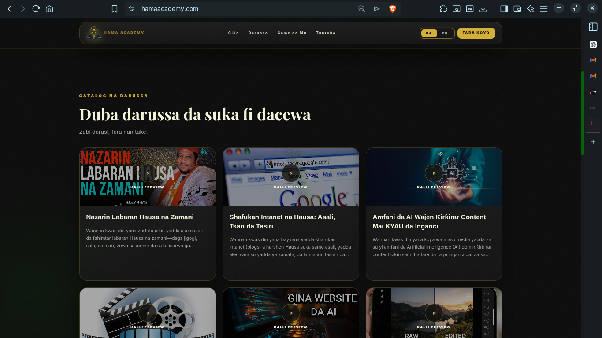
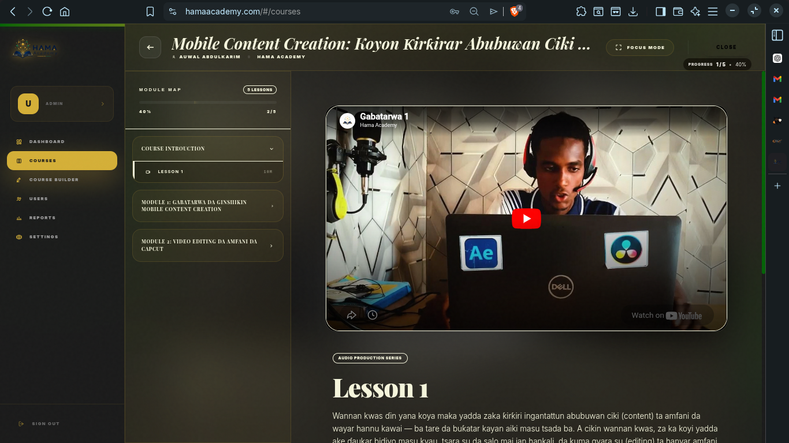

## 🏗 Architecture

Frontend: React + Tailwind  
Backend: Supabase (Postgres + Auth + Storage)  
Payments: Paystack  
Server Logic: Edge Functions  

Flow:
User → Enroll → Payment → Verification → Course Unlock → Certificate
## 🖼️ Screenshots

### 🎓 Course Catalog & Discovery

*Users can browse available courses with rich previews and structured learning paths.*

---

### 🔐 Authentication Experience

*Clean login experience designed with strong HAMA branding and a focused learning entry point.*

---

### 📺 Learning Dashboard & Module System

*Interactive learning interface with video lessons, module navigation, progress tracking, and structured course flow.*
